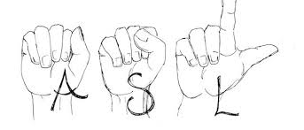

# Project 3 - Final Challenge
Final Project - Machine Learning Challenge

# American Sign Language Recognition

## Project Description/Rationale
Sign language recognition, generation and translation is a research area with high potential impact. According to the World Federation of the Dead, there are over 300 sign languages used around the world, and 70 million deaf people using them. Sign language is distinct from spoken languages and does not have standard written forms. However, the vast majority of communications technologies are designed to support spoken or written languages; which excludes sign languages. Most people do not know sign language and as a result, many communication barriers exist for deaf sign language users. We are trying to train a machine learning model on American sign Language recognition.

## Project Scope
* **Identifying Alphabet/Numeral Gestures within American Sign Language**.
* **Developing a Visual Recognition**

### Datasets
* <https://www.kaggle.com/datamunge/sign-language-mnist>
* <https://www.kaggle.com/paultimothymooney/interpret-sign-language-with-deep-learning>
* <https://www.kaggle.com/serkanpeldek/cnn-practices-on-sign-language-digits>